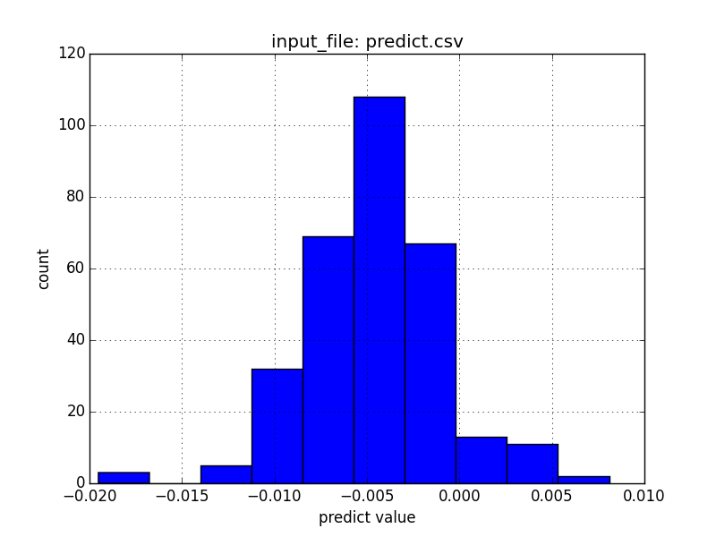
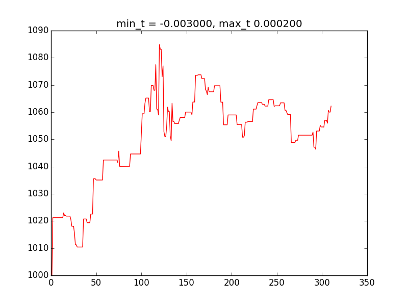
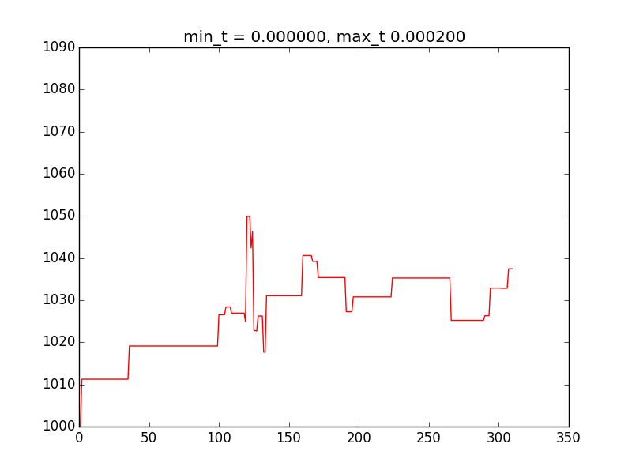
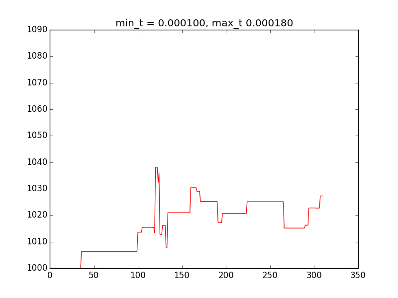

## 数据模块
### Data类
依赖`pandas`库，从csv文件中读取数据。csv文件有两列，输入价格序列`price_list`和预测序列`predict_list`
默认数据源为`predict.csv`,可由excel另存为csv格式得到,两列数据的名称分别设为"price"和"predict"。

### 函数
- `plot_hist(output)`
    统计并画出数据源中predict的频数分布,保存为`$output`png格式图片
    

## 回归模块

### Regression类
调用接口为`do_regression`函数，输入价格序列`price_list`和预测序列`predict_list`，分别对应第i天的价格`price`和对第i+1天的涨幅预测`predict`，模拟交易过程，输出4个统计量：年化收益率`reward`、胜率`win_rate`、最大回撤`max_drawdown`、盈亏比`win_loss_ratio`。
``` python
    re = Regression(config)
    (reward, win_rate, max_drawdown, win_loss_ratio) = re.do_regression(price_list, predict_list)
```
`config`为参数字典。根据参数可定义一个*涨幅预测-持仓比*的分段函数，分段函数两端截止，分别代表平仓和满仓，中间单调递增。`min_threshold`为策略分段函数中间部分的左端点,`max_threshold`为分段函数中间部分的右端点,`func_type`为分段函数中间部分的函数类型，支持对数、指数、线性函数。`init_money`指定初始资金值。
``` python
    config = {
        "min_threshold": 0.000,  # 分段函数中间部分的左端点
        "max_threshold": 0.002,  # 分段函数中间部分的右端点
        "init_money": 1000,  # 回归模拟的初始资金
        "func_type": LINEAR,    # 分段函数中间部分的函数类型，支持LOG，EXP， LINEAR
        }
```
模拟过程为，`re.do_regression`函数不断调用`re.tick(price, predict)`根据预测的涨幅`predict`得到新的仓位值`hold`，并据此调用`re._buy(amount, price)`和`re._sell_out(price)`以调整到该仓位。`re._buy`负责指定的买入或卖出动作,`re._sell_out`负责平仓。每次交易都会更新`re`的内部状态（如仓量`re.stock`,现金`re.currency`,持仓比`re.hold`等），并最后输出统计量。

### 函数
- `test(min_t, max_t)`
    给定参数新建`Regression`对象和`Data`类，读取数据并进行模拟，返回4个统计量
- `brute_force()`
    给定`max_threshold`的上下界和`min_threshold`的上下界，在区间内等间隔取10个点，10*10循环调用`test`函数暴力调参

    打印出4个10*10统计量矩阵
- `plot_asset(min_t, max_t, output="asset")`
    给定参数进行模拟，并画出总资产随时间变化曲线, 保存为`$output`png格式图片

    高风险参数组合
    

    中等风险参数组合
    

    低风险参数组合
    

